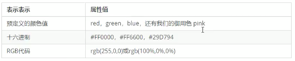
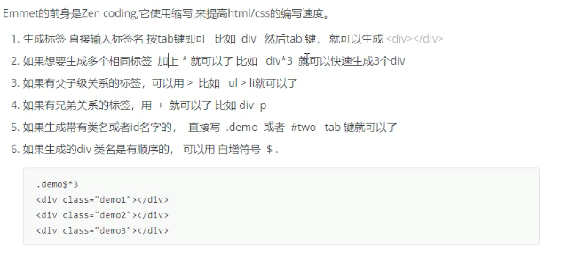
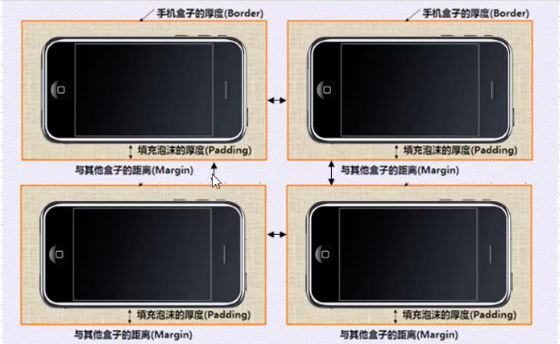

CSS

> CSS 学习三大重点：盒子模型、浮动、定位

## Day 3

### 1 引入css样式方法

#### 1.1 行内式/内联式

> 直接写在标签内部

```html
<h1 style="color:pink; font-size:18px;"> dhakdha</h1>
```

#### 1.2 内部样式

> 写在head内上的style

```html
<head>
		<style type="text/css">
      h1 {
        color:pink;
        font-size:18px;
      }
  	</style>
</head>
```

#### 1.3外部样式表/外链式

> 需新建外部css文件

```html
<head>
  	<link rel="stylesheet" type="text/css" href="style.css" />
</head>
```

```css
h3 {
	color:pink;
  font-size:18px;
}
```

<hr />
### 2 基础选择器

> 找到特定的HTML页面元素 - 选择标签

#### 2.1 标签选择器

> 无法实现差异化选择

```css
div {
	color:pink;
}
```

#### 2.2 类选择器

> 可实现差异化选择
>
> 一个标签只能有一个类
>
> 多个类使用空格隔开class=”class1 class2 class3“

```css
.red {
  color:pink;
}
```

```html
<div class="red foot100">hvrhv</div>
```

#### 2.3 id选择器

> 类似 类选择器
>
> id选择器一般和javascript一起使用
>
> 类选择器相当于人名，id选择器相当于身份证
>
> 类选择器可使用多次，id选择器只能使用一次

```css
#red {
  color:pink;
}
```

```html
<div id="red">hvrhv</div>
```

#### 2.4 通配符选择器

> 会选择所有标签

```css
* {
  color:pink;
  margin: 0;
  padding: 0;
}
```

#### 2.5 总结

> 常用tips

- 尽量少使用通配选择器
- 尽量少使用ID选择器
- 尽量不使用无语义命名选择器

<hr />
### 3 字体

#### 3.1 字体大小

> font-size
>
> 常用单位为px
>
> 一般直接给body指定font-size

#### 3.2 字体类型

> font-family
>
> font-family: Arial, "Microsoft YaHei", "微软雅黑", "黑体"；


#### 3.3 字体粗细

> font-weight, <b>, <strong>
>
> 400 == normal, 700 == bold
>
> font-weight: normal | bold | bolder | lighter | number(100, 200, 300, ..., 900)

#### 3.4 字体风格

> font-style, <i>, <em>
>
> font-style: normal | italic

#### 3.5 字体综合

> font : italic 700 20px "微软雅黑";
>
> foot : foot-style foot-weight font-size/line-height font-family
>
> font 顺序是固定的，属性使用空格隔开，必须保留 font-size 和 font-family

<hr />
### 4 CSS外观属性

#### 4.1 color 文本颜色



#### 4.2 line-height 行间距

> line-height
>
> 行高比字体大7~8px
>
> line-height: px | em | %

#### 4.3 text-align 文本对齐方式

> text-align: center | left | right ;

#### 4.4 text-indent 首行缩进

> text-indent:em 字符宽度的**倍数**

#### 4.5 text-decoration 文本装饰

> text-decoration: none | underline | blink | overline | line-through

<hr />
### 5 sublime快捷键emment语法




## Day 4

### 1 复合选择器

> .

#### 1.1 后代选择器/包含选择器

```html
<div class="nav">
  <a href="#">链接</a>
  <a href="#">链接</a>
  <a href="#">链接</a>
</div>
```

```css
.nav a {
  color:pink;
}
```

#### 1.2 子代选择器/直选子元素

```css
div>a {
  color:pink;
}
```

#### 1.3 交集选择器

- h3.class {color:red; font-size:25px}
- 标签选择器.类别选择器 {属性：值}
- 不包含空格
- 不常用

```c++
p.one {
  color:red;
}
```

#### 1.4 并集选择器

- , 隔开
- 通常用于集体申明：样式相同

```css
p, 
span {
  color:red;
}
```

### 2伪类选择器

> :

#### 2.1 链接伪类

- a:link         未访问的链接
- a:visited    已访问的链接
- a:hover     鼠标移动到链接上
- a:active    选定的链接

- 顺序：lvha

<hr />
### 2 标签显示模式

```css
display:block | inline | inline-block
```

#### 2.1 块级元素

> 常见元素<h1> ~ <h6>, <div>, <p>, <dt> 

- 独占一行
- 高度、宽度、外边距、内边距都可以控制
- 宽度默认是父级容器的100%
- 是一个容器级盒子，里面可以放行内或者块级元素
- p, h, dt(文字级块标签) 标签里面不能放块级元素

#### 2.2 行内元素

> 常见元素：<a>, <strong>, <em>, <i>, <span>, 等

- 一行可以放多个
- 宽度、高度设置无效，与内容有关
- 只能容纳文字和其他行内元素

####2.3 行内块元素

> , <input />, <td>

- 一行可以放多个, 空格隔开
- 默认宽度、高度与内容相关
- 高度、宽度、外边距、内边距都可以控制


<hr />
###3 行高

> 可以让单行文本在盒子中垂直居中对齐：文字高度等于盒子高度


> 文字与行高的关系, **块级盒子**

- 行高 = 盒子高度， **单行文字**会垂直居中
- 行高 > 盒子高度，**单行文字**会偏垂直向上
- 行高 < 盒子高度，**单行文字**会偏垂直向下

<hr />
###4 背景

#### 4.1 背景平铺

> background : background-color | background-image | background-repeat | background-attachment | background-position

```css
.bg {
  background-color : transparent | pink;
  background-image : url(images.img1.jpg);
  background-repeat : repeat | no-repeat | repeat-x | repeat-y
}
```

#### 4.2 背景位置

> background-position : length | length

> background-position : position | position

> length : 百分数 | 有浮点数字和单位标识符组成的长度值

> position ：top | center | bottom | left | center | right

#### 4.3 背景附着/滚动

> background-attachment : scroll | fixed

#### 4.4 背景简写

> background : 背景颜色 背景图片地址 背景平铺 背景滚动 背景位置
>
> 顺序不固定，推荐顺序：背景颜色 背景图片地址 背景平铺 背景滚动 背景位置

```css
body {
  background : #ccc url(images/img2.jpg) no-repeat fixed center top;
}
```

#### 4.5 背景半透明

> background : rgba(0, 0, 0, .3);
>
> 第四维表示半透明，数值区间：0~1

```css
.alpha {
  width: 300px;
  height: 300px;
  background: rgba(0, 0, 0, 0.3);
}
```

#### 4.6 背景总结


<hr />
### 5 CSS三大特性

#### 5.1 继承性

> 子标签会继承父标签的某些样式，比如文本颜色和字号

> 可继承的样式：text- , font- , line- 等开头的元素

#### 5.2 优先级

>  选择器相同，则执行层叠性（就近原则）

> 选择器不同，则按照优先级来执行样式，优先执行优先级高的


#### 5.3 权重叠加

实际生活中会使用交际选择器、后代选择器等多种基础选择器组合而成，其对应的权重可直接进行相加

- div ul li   ----->0,0,0,3

- .nav ul li ----->0,0,1,2

- 数位之间没有进制

- 如果计算后的权重相同则执行就近原则

- 继承的权重是0,修改样式时，一定要看该标签有没有被选中

  - 如果被选中，则按照公式计算新的权重
  - 如果没被选中，那么权重是0，因为继承的权重是0

<hr />
## Day 5 盒子模型

### 1 盒子模型

- 内容
- 边框 border
- 内边距 padding
- 外边距 margin
- 宽度 Element Height = content height + padding + border
- 高度 Element Width = content width + padding + border



<hr />
### 2 边框border

> border : border-width | border-style | border-color

> border : 边框粗细 样式 颜色 （顺序不固定）

> border-width : medium | thin | thick | length(px)

> border-style : none | dotted | dashed | solid

> border-top 上边框，border-left 左边框，border-right 下边框，border-bottom 下边框

> 表格的细边框(合并相邻边框) border-collapse : collapse;

<hr />
### 3 内边距padding

> 边框与内容的距离

> padding : padding-left | padding-right| padding-top | padding-bottom

> 当内容和边框有了距离后（添加内边距）盒子会变大
>
> 可固定盒子大小方法1：改变内容宽度width
>
> 可固定盒子大小方法2：该盒子没有宽度/高度，则定义padding不会撑开盒子
>
> 块级盒子不指定宽高时，默认和父盒子相同


<hr />
### 4 外边距margin

> 盒子与盒子的距离

> margin : margin-left | margin-right| margin-top | margin-bottom


> 块级盒子水平居中

- 盒子必须制定宽度width
- 左右的外边距设置为auto
  - margin-left:auto; margin-right:auto;
  - margin:auto;
  - margin:0 auto;

> 盒子里面的文字、行内元素、行内块元素水平居中

- text-align: center;

> 插入图片与背景图片的区别

- 插入图片，常用于产品展示，移动位置只能靠盒模型：padding, margin
- 背景图片，小图片或超大背景，移动位置只能通过：background-position

> 清楚元素的默认内外边距

```css
* {
  margin: 0;
  padding: 0;
}
```

> 行内元素，一般只设置左右内外边距

> 垂直外边距有自动合并问题，
>
> 只取两盒子的外边距最大值，
>
> 一般添加1个盒子的外边距即可

> 嵌套块元素垂直外边距的合并（塌陷）


> 去掉列表默认的样式

```css
li {
  list-style: none;
}
```

<hr />
## Day 6 浮动 float

### 1 普通流/标准流

#### 1.1 块级元素

> 独占一行，从上到下的顺序排列

- div, hr, p, h1~h6, ul, ol, form, table 

#### 1.2 行内元素

> 从左到右的顺序排列，碰到父元素边缘则换行

- span, a, i, em等

<hr />
### 2 浮动

> 行内块能使多个块级元素一行显示，但无法去除、修改中间缝隙

> 让盒子从普通流中浮动起来，主要作用是让多个块级盒子一行显示

> float : none | left | right


#### 2.1 浮动和标准流的父盒子搭配

> 浮动是脱标的，需给浮动的元素加一个标准流的父亲，以减小对其他标准流的影响


#### 2.2 浮动元素与父盒子的关系
> 子盒子的浮动参照父盒子对齐
> 不会与父盒子的边框重叠，也不会超过父盒子的内边距


#### 2.3 浮动元素与兄弟盒子的关系

> 浮动只会影响当前或者后面的盒子，不影响当前的标准流


#### 2.4 清除浮动

> 因为父盒子在很多情况下无法确定高度，所以子盒子浮动后会引起父盒子高度为0，需清除浮动

```css
.clear {
		clear : left | right | both;
}
```

- 额外标签法

  - 在最后一个浮动元素添加空标签

    ```css
    <div class="clear"></div>
    ```

- 父级添加overflow属性

  ```css
  overflow : hidden | auto | scroll
  ```

- 父级添加after伪元素清除浮动

  

- 父级添加双伪元素清除浮动
  
  ```css
  
  ```


#### 2.5 CSS 属性顺序

+ 布局定位属性
  - display, position, float, clear, visibility, overflow
+ 自身属性
  - width, height, margin, padding, border, background
+ 文本属性
  - color, font, text-decoration, text-align, vertical-align, white-space, break-word
+ 其他属性
  - content, cursor, border-radius, box-shadow, text-shadow, background, linear-gradient

<hr />
## Day 7 定位

> 定位 = 定位模式 + 边偏移


### 1 定位模式


#### 1.1 静态定位

> position : static;

> 静态相当于无定位

> 按照标准流显示，没有边偏移

> 日常生活基本不使用静态定位

#### 1.2 相对定位

> position : relative; top:10px; left:10px;

> 相对于原来在标准流位置上加上边偏移（自恋型）

> 原来在标准流中占有的位置，保留占有（标准流）

#### 1.3 绝对定位

> position : absolute; top:10px; left:10px;

> 子绝父相：子不占位置，父占位置

> 完全脱标，不占标准流位置

> 绝对定位盒子（如果祖先没有相对/绝对/固定定位）会以文档/浏览器对准
>
> 绝对定位盒子（如果祖先有定位），则会根据最近的已有定位的祖先进行定位

#### 1.4 固定定位

> position:fixed; top:10px; right:10px;

> 完全脱标，不占位置

> 只以文档/浏览器可视区为准，与祖先无关, 不随滚动条滚动

#### 1.5 定位扩展

##### 1.5.1 绝对定位的盒子居中

> 绝对定位margin:auto无法让盒子居中

> 绝对定位盒子要想居中，通过设置left:50%（父亲盒子的一半）, margin-left: -100px(自身盒子的一半)


##### 1.5.2 堆叠顺序（z-index）

> 正整数、0（默认）、负整数

> z-index 数字后面不需要加单位

> 如果属性值相同，则按照书写顺序，后来居上

> z-index只能应用于相对定位、绝对定位、固定定位的元素，其他标准流、浮动、静态定位无效


##### 1.5.3 定位改变display属性

- 行内块默认宽度为内容 
- inline-block 转换为行内块
- float默认转化为行内块（脱标）
- 绝对定位和固定定位（类似float）默认转换为行内块

#### 1.6 总结

> 浮动元素、绝对定位/固定定位元素都不会触发外边距合并问题（以前使用border,padding, overflow解决）

> 一个行内的盒子，如果加了浮动、固定定位、绝对定位，无需显示转换为inline-block, 可直接给盒子设置宽高


## Day 8


## Day 9


## Day 10


## Day 11


## Day 12


## Day 13


## Day 14