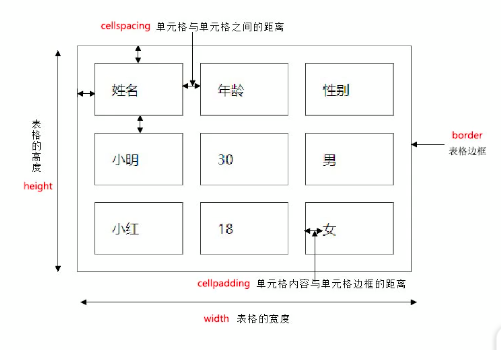
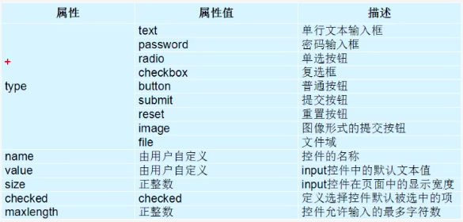

# HTML

## Day 1

> tips

- html : 5 与 !  加tab都可实现HTML页面骨架

### 1. 常用标签

```html
<!DOCTYPE html>
<html lang="en">
<head>
	<meta charset="UTF-8">
	<title>Document</title>
</head>
<body>
</body>
</html>
```

#### 1.1 排版标签

##### 1.1.1标题标签

```html
<h1> 标题文本</h1>
<h2> 标题文本</h2>
<h3> 标题文本</h3>
<h4> 标题文本</h4>
<h5> 标题文本</h5>
<h6> 标题文本</h6>
```

##### 1.1.2 段落标签

```html
<p> 段落标签</p>
```

##### 1.1.3 水平线标签

```html
<hr />
```

##### 1.1.4 换行标签

```html
<br />
```


##### 1.1.5 div与span标签

```html
<div> </div> 一行只能放一个div标签
<span> </span> 一行可放多个span标签
```


#### 1.2 文本格式化标签

```html
<b>加粗</b>      <strong>加粗 + 强调</strong>
<i>倾斜</i>      <em>倾斜 + 强调</em>
<s>加删除线</s>   <del>加删除线 + 强调</del>
<u>下划线</u>     <ins>下划线 + 强调</ins>
```


#### 1.3 标签属性

```html
<标签名 属性1="属性值1" 属性2="属性值2"> 内容 </标签名>
```


#### 1.4 图像标签

| 属性   | 属性值 | 描述                     |
| ------ | ------ | ------------------------ |
| src    | URL    | 图像路径                 |
| alt    | 文本   | 图像不能显示时的替换文本 |
| title  | 文本   | 鼠标悬停时显示的内容     |
| width  | 像素   | 图像宽度                 |
| height | 像素   | 图像高度                 |
| border | 数字   | 图像边框宽度             |


#### 1.5 链接标签

```html
<a href="链接", target="_self/_blank"> </a>
```


#### 1.6 注释标签

```html
<!-- 注释标签 -->

```


### 2 路径

- 相对路径
- 绝对路径

### 3 今日总结

### 4 结合案例：圣诞

<hr />

## Day 2

### 1. 表格
#### 1.1 表格基础

```html
<table border="1" width="500" height="200" align="center">
  	<caption>表格标题</caption>
  	<thead>
  			<tr>
      			<th>表头单元格</th>
    		</tr>
  	</thead>
  
  	<tbody>
  			<tr>
      			<td>数据单元格</td>
    		</tr>
  	</tbody>
  
  	<tfoot>
  			<tr>
      			<td>数据单元格</td>
    		</tr>
  	</tfoot>
    
</table>
```

cellpadding 单元格内容与单元格边框的距离 

cellspacing 单元格与单元格之间的距离



#### 1.2 表格合并

- 跨行合并 rowspan="合并单元格的个数"
- 跨列合并 colspan="合并单元格的个数"
- 合并顺序：从上到下，从左到右

<hr>
### 2. 表单

#### 2.1 input



```html
用户名：<input type="text" value="请输入用户名" name="username" /> <br/>
密码：<input type="password" value="请输入密码" name="pwd" /> <br/>
性别： 
			男<input type="radio" name="sex" />
			女<input type="radio" name="sex" checked="checked" /> <br/>
爱好：
			睡觉<input type="checkbox" name="hobby" />
      电影<input type="checkbox" name="hobby" />
      音乐<input type="checkbox" name="hobby" />     <br/>

<input type="button" value="获取短信验证码"/>

```

#### 2.2 label

用于绑定一个表单元素，当鼠标点击label标签时，被绑定的表单元素就会获得输入焦点

```html
<label>用户名：<input type="text" value="请输入用户名" name="username" /></label> <br/>

<label for="nc">用户名：</label><input type="text" value="请输入用户名" name="username" id="nc"/> <br/>
```

####2.3 textarea控件（文本域）

```html
用户留言：
<textarea>
  	文本域
</textarea>
```

#### 2.4 select 下拉列表

- 样式不好修改，所以不常用，一般用div+ul+li模拟select下拉列表

```html
<select>
 		<option selected="selected">北京</option>
  	<option>上海</option>
 		<option>广州</option>
</select>
```

#### 2.5 表单域

```html
<form action-"">
    用户名：<input type="text" value="请输入用户名" name="username" /> <br/>
    密码：<input type="password" value="请输入密码" name="pwd" /> <br/>
    性别： 
          男<input type="radio" name="sex" />
          女<input type="radio" name="sex" checked="checked" /> <br/>
    爱好：
          睡觉<input type="checkbox" name="hobby" />
          电影<input type="checkbox" name="hobby" />
          音乐<input type="checkbox" name="hobby" />     <br/>

    <input type="button" value="获取短信验证码"/>
  	<input type="submit" />
  	<input type="reset" />
</form>
```

| 属性   | 属性值   | 作用                   |
| ------ | -------- | ---------------------- |
| action | URL      |                        |
| method | get/post |                        |
| name   | 名称     | 区分同一页面的多个表单 |


<hr />
### 3. 列表


> 比起表格，有更大的自由度

#### 3.1 无序列表

```html
<ul>
  	<li>香蕉</li>
  	<li>苹果</li>
  	<li>榴莲</li>
</ul>
```

#### 3.2 有序列表

```html
<ol>
  	<li>first</li>
  	<li>second</li>
  	<li>third</li>
</ol>
```

#### 3.3自定义列表

```html
<dl>
  	<dt>名词</dt>
  	<dd>名词解释1</dd>
  	<dd>名词解释2</dd>
  	<dd>名词解释3</dd>
</dl>
```

<hr />