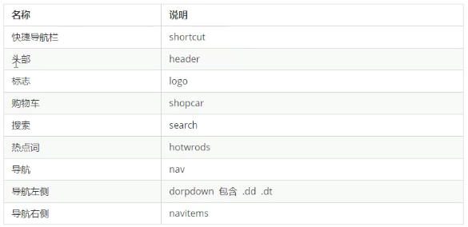

# Project1 品优购

## Day 1

### 1. favicon.ico 网站图标

> favicon.ico 放置在根目录

> jpg图片转换**ico图标**: www.bitbug.net

```html
<link rel="shortcut icon" href="favicon.ico"  type="image/x-icon"/> 
```

### 2. 搜索引擎优化-三大标签

- title | description | keyword
- title: 网站名（产品名）- 网站的介绍
  - 品优购-综合网购首选-正品低价、品质保障、配送及时、轻松购物
- description: 网站说明
  - 不超过120个词
- keyword: 关键词

### 3. 字体图标

- 与图片相同：改变透明度、旋转度...
- 与文字相同：改变颜色、产生阴影、透明效果...
- 体积更小，支持所有浏览器、移动设备
- 常用免费字体图标网站：
  - www.iconfont.cn
  - www.icomoon.io

```html
 
```

### 4. 品优购首页布局



### 5. logo优化

- logo 里面放一个**h1**标签，母的是为了提权，告诉搜索引擎，这个地方重要
- h1里面放一个链接，用于返回首页，给一个大小和logo的背景图片
- 链接里面放文字，但不要文字显示出来，可用font-size: 0, 或者text-indent + overflow实现
  - text-indent: -9999px;
  - overflow: hidden
- 链接再给一个title, 使得鼠标放在logo上时可以看到文字

## Day 2


## Day 3


## Day 4